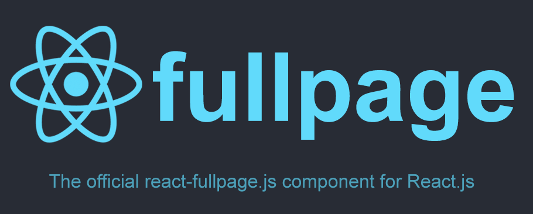

# react-fullpage



<p align="center">Official React wrapper for the <a target="_blank" href=""https://github.com/alvarotrigo/fullPage.js/">fullpage.js library</a></p>

<p align="center">
  
</p>

- [Demo online](https://alvarotrigo.com/react-fullpage/) | [Codepen](https://codepen.io/alvarotrigo/pen/zpQmwq)
- [fullpage.js Extensions](https://alvarotrigo.com/fullPage/extensions/)
- Brought by [@imac2](https://twitter.com/imac2) thanks to [Michael Walker](https://github.com/cmswalker).

## Table of Contents

- [Installation](https://github.com/alvarotrigo/react-fullpage#installation)
- [License](https://github.com/alvarotrigo/react-fullpage#license)
- [Usage](https://github.com/alvarotrigo/react-fullpage#usage)
- [Examples](https://github.com/alvarotrigo/react-fullpage#examples)
- [State](https://github.com/alvarotrigo/react-fullpage#state)
- [Props](https://github.com/alvarotrigo/react-fullpage#props)
- [Methods](https://github.com/alvarotrigo/react-fullpage#methods)
- [Callbacks](https://github.com/alvarotrigo/react-fullpage#callbacks)
- [Contributing](https://github.com/alvarotrigo/react-fullpage#contributing)
- [Resources](https://github.com/alvarotrigo/react-fullpage#resources)

## Installation

```sh
npm install @fullpage/react-fullpage
```

This will install the wrapper as well as [fullpage.js](https://github.com/alvarotrigo/fullPage.js/)

## License

### Commercial license

Although react-fullpage is under the MIT license as can be seen on the [LICENSE file](https://github.com/alvarotrigo/react-fullpage/blob/master/LICENSE), notice [fullPage.js library](https://github.com/alvarotrigo/fullPage.js) is under GPLv3. Therefore you'll need to purchase a Commercial License for fullPage.js if you want to use fullPage to develop commercial sites, themes, projects, and applications. [[Purchase a Fullpage Commercial License]](https://alvarotrigo.com/fullPage/pricing/)

### Open source license

If you are creating an open source application under a license compatible with the [GNU GPL license v3](https://www.gnu.org/licenses/gpl-3.0.html), you may use fullPage under the terms of the GPLv3.

**The credit comments in the JavaScript and CSS files should be kept intact** (even after combination or minification)

[Read more about fullPage's license](https://alvarotrigo.com/fullPage/pricing/).

## Usage

This wrapper creates a ```<ReactFullpage />``` component. It exposes a render-prop API so markup can remain the same across fullpage.js libraries. The render prop accepts 1 parameter in its callback which contains the component's react properties state, context, etc.

## Examples

In-depth examples can be found [here](https://github.com/alvarotrigo/react-fullpage/tree/master/example)

Quickstart Example:

```js
import React from 'react';
import ReactDOM from 'react-dom';
import ReactFullpage from '@fullpage/react-fullpage';

const fullpageOptions = {
  callbacks: ['onLeave'],
};

const FullpageWrapper = fullpageProps => (<ReactFullpage
  {...fullpageProps}
  render={({ state, fullpageApi }) => {
    return (
      <div>
        <div className="section">
          <p>Section 1 (welcome to fullpage.js)</p>
          <button onClick={() => fullpageApi.moveSectionDown()}>Click me to move down</button>
        </div>
        <div className="section">
          <p>Section 2</p>
        </div>
      </div>
    );
  }}
/>);

ReactDOM.render(<FullpageWrapper {...fullpageOptions} />, document.getElementById('react-root'));
```

## State

The wrapper maintains state in accordance to the latest version of fullpage.js [callbacks](https://github.com/alvarotrigo/fullPage.js#callbacks)

State changes will only trigger for callbacks registered via the callbacks prop

*NOTE: if the v2 prop is passed, state will be mapped to v2 [callbacks](https://github.com/alvarotrigo/fullPage.js/tree/v.2.9.7#callbacks)*

## Props

You can use any [options](https://github.com/alvarotrigo/fullPage.js#options) supported by fullPage.js library as react props.

Props object can contain standard [options](https://github.com/alvarotrigo/fullPage.js#options) as well as fullPage.js [callbacks](https://github.com/alvarotrigo/fullPage.js#callbacks).

The only difference in API is that you must provide the standard fullpage.js library as a [prop](https://github.com/alvarotrigo/react-fullpage/blob/master/example/index.js#L13) and callbacks should be an array of strings containing the callback name you'd like to subscribe to.

More on callbacks [here](https://github.com/alvarotrigo/react-fullpage#callbacks)

*NOTE: jquery must be passed as a prop ($) if using the v2 API*

## Methods

fullPage.js contains many [methods](https://github.com/alvarotrigo/fullPage.js#methods).
You can use any of them. These are made available as properties on the imported `fullpage.js` library once the first render has occured.

## Callbacks

As mentioned [above](#props) you can pass callbacks through options object as an array of strings:
Each callback name passed to the component will maintain state itself and this will be reflected via the [render prop](#usage)
Callback parameters and the latest callback fired by fullpage.js will be reflected in [state](#state).

## Contributing

Found an issue? Have an idea? Check out the [Contributing](https://github.com/alvarotrigo/react-fullpage/blob/master/CONTRIBUTING.md) guide and open a PR

## Resources

- [Wordpress theme](https://alvarotrigo.com/fullPage/utils/wordpress.html)
- [CSS Easing Animation Tool - Matthew Lein](http://matthewlein.com/ceaser/) (useful to define the `easingcss3` value)
- [fullPage.js jsDelivr CDN](http://www.jsdelivr.com/#!jquery.fullpage)
